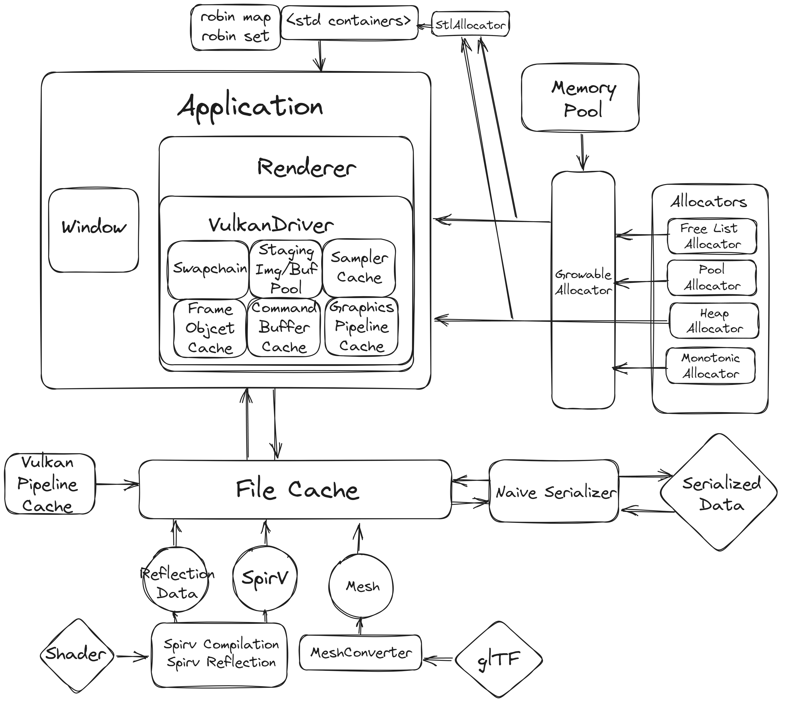
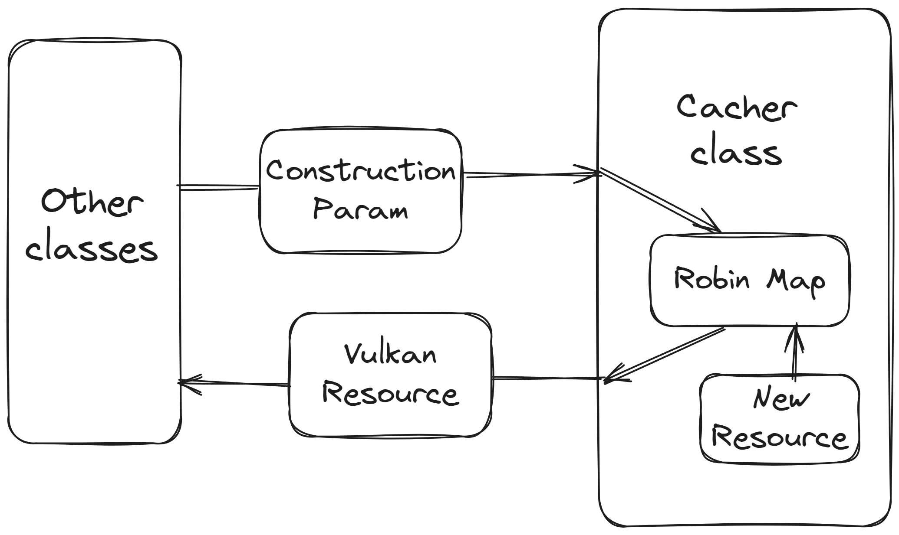

# Coust

## Intro

Welcome to my C++ and graphics playground! Coust is an on-progress real-time Vulkan renderer written in C++20, my intention here is to learn all kinds of stuff related to graphics programming and C++ by implementing these exciting techniques myself. The application architecture derives from [Hazel](https://www.youtube.com/playlist?list=PLlrATfBNZ98dC-V-N3m0Go4deliWHPFwT) and the Vulkan driver (still developing) mainly mimics the Vulkan driver part of the [filament](https://github.com/google/filament) renderer from Google. 

## Overview



The project can be divided into four main parts by folders:

- `core`: The entry point for the entire project

	- `Application`: Controlling the execution of the whole program
	- `Logger`
	- `Window`: Simple wrapper class around SDL window
	- `Memory`: Custom memory allocation, provides a global function `get_default_alloc()` for access to a global allocator

- `event`: Different systems communicate using events, that's why there's a separate folder for them. This part comes from the Hazel engine as well, though I replace the dynamic polymorphism with static polymorphism (templates in other words), with which we can specify the category of event class by:

	```c++
	class FuzzyEvent: public Event<"Category1 Category2 Category3"> {};
	```

- `render`: The most interesting part. The Vulkan driver in filament adopts a data-oriented path where the driver class acts like a factory. But here we still wrap most of the Vulkan resources into various classes for the sake of clearer structure. Most Vulkan classes are cached in another cache class and we use the construction parameter as the hash key. The cacher class will check the last access time of each free resource and recycle it when it hasn't been used for a while (controlled by `GARBAGE_COLLECTION_PERIOD`)

	

- `utils`: Other useful stuff
	- `allocators`: All allocators, memory pool, and wrappers around the stl allocator and stl containers
	- `containers`: Robin map and Robin set "copied" from [Tessil/robin-map](https://github.com/Tessil/robin-map), and explicitly prohibiting the use of the evil `[]` operator!
	- `filesystem`: Responsible for communicating with the file system of the OS and caching some expensive-to-construct objects to disk with the help of a naive serializer. This naive implementation can handle most of the containers and classes with the standard layout, inspired by this talk [Killing C++ Serialization Overhead & Complexity - Eyal Zedaka - CppCon 2022](https://youtu.be/G7-GQhCw8eE)
	- `aligned storage`: A replacement of raw/smart pointer when we need to decouple the memory allocation and object construction
	- Blah blah...

## Rewriting plan / TODO

The old Coust isn't written with c++20 and all its good stuff in mind. So I decided to rewrite the whole project with a more modern approach (hope so), and that should be a lot of fun :)


-   Switch build system to CMake
-   Speed up build time
    -   [Build Time trace](https://clang.llvm.org/docs/ClangCommandLineReference.html#cmdoption-clang-ftime-trace)
    -   Building cache: [sccahe](https://github.com/mozilla/sccache)
-   Rust-like `result` or C++23-like `std::expected` error handling style
-   More adoption of STL algorithm
-   More lambda
-   More compact coding style
    Not this
    ```C++
    [[nodiscard]] constexpr int Add(int l, int r) noexcept
    {
        return l + r;
    }
    ```
    but this
    ```C++
    [[nodiscard]] constexpr int add(int l, int r) noexcept {
        return l + r;
    }
    ```
-   `constexpr` everything! (not really)
    -   There's an important use case of compile-time programming -- enums. Lot's of time we just want to transform a enum literal to a library specific type (like to a vulkan enum) and we can completely get rid of any run-time overhead (even though they might be just several instructions) when use our own enum, which is great.
-   `noexcept` and `const` everything!
-   Give `[[likely]]`, `[[unlikely]]`, restrict and `[[assume()]]` a chance
    -   `[[assume()]]` is a new feature presented in C++23 which isn't fully available yet, but we have compiler extensions:
        -   MSVC: [`__assume()`](https://learn.microsoft.com/en-us/cpp/intrinsics/assume?view=msvc-170)
        -   clang: [`__builtin_assume()`](https://clang.llvm.org/docs/LanguageExtensions.html#langext-builtin-assume)
    -   restrict isn't part of C++ standard, but it's supported by many compilers
        -   MSVC: [`__restrict`](https://learn.microsoft.com/en-us/cpp/cpp/extension-restrict?view=msvc-170)
-   Radically optimization: Fast math, no run-time type information and no exception
-   Replacing `std::unordered_map` (implemented in link list) with robin map
-   Job system